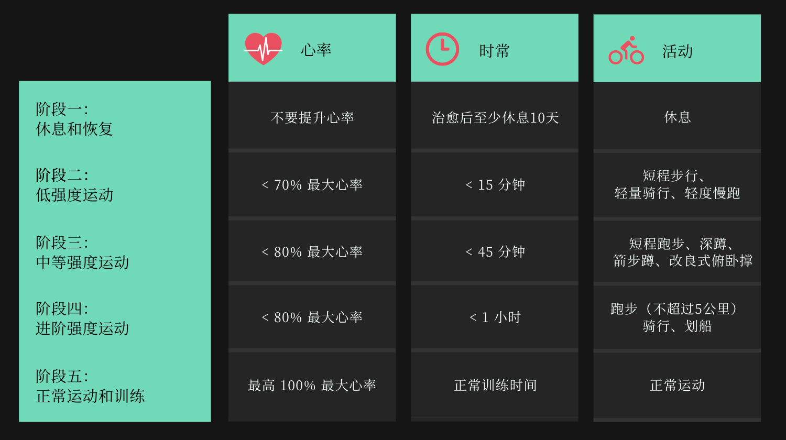
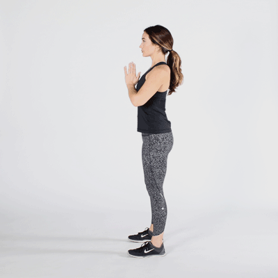
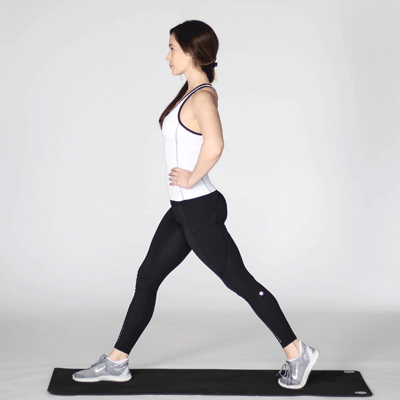

# 新冠后如何恢复运动

在被 COVID-19 困在室内并与世隔绝后，我们都急于回归到常规生活。然而恢复运动取决于我们在COVID-19之前的健康水平，以及我们的年龄和生病的程度。

如何安全地恢复运动呢？内布拉斯加医疗中心（ *Nebraska Medicine*）的心脏病专家安德森博士（Dan Anderson, MD, PhD）和物理治疗师沃斯拉格（Brett Woslager, DPT, CSCS）提供了以下建议。

### 运动使 COVID-19 病情恶化吗？是的

在你患有 COVID-19 或任何其他感染时，运动是不可取的。"我们知道 COVID-19 可以引起心肌炎和心脏损伤，"安德森博士说。"虽然 COVID-19 正在损害你的细胞，但你可能做的最糟糕的事情是给你的心脏施加压力，使它受到更大的损害。"

在再次运动之前，给自己时间休息和恢复。"你需要等到你没有活跃的病毒感染，"安德森博士说。"在患COVID-19后至少要等10天才能运动。然后用身体去感受，分阶段恢复，每个阶段大约持续两到三天。" 

### COVID-19的锻炼规则是什么？

如果你感染了COVID-19，不要去健身房或其他共享空间。在你有传染性的时候，要将自己与他人隔离。

#### 分阶段慢慢恢复运动

"对于一个健康人来说，你首先要恢复到没有疲劳的基本功能，"沃斯拉格说。"如果你有骨科问题或其他疾病，放松慢慢来。"

"你应该能够在运动时进行对话。不要过度运动。倾听你的身体，问问自己的真实感受，"安德森博士说。

##### 试试这些短时的低压力运动

\- 步行
\- 固定骑自行车
\- 轻度慢跑 

##### 之后，你可以转到轻量级的身体自重任务

\- 深蹲

\- 箭步蹲

\- 提踵

\- 改良式俯卧撑 

"最主要的是慢慢来，朝着你以前的功能水平逐步进展，"沃斯拉格说。

"恢复锻炼不应该是一个'睾丸激素高于智商'的时刻，"安德森博士补充说。"如果你感觉不舒服，就降低你的运动强度。"

### 恢复活动时监测心率

"心率是衡量身体状况的一个重要标准，"安德森博士说。"它是衡量你的身体对运动的耐受性的一个很好的标准。将你的运动水平与你的身体可以承受的水平相匹配。"

"有些人有轻微的COVID-19症状，而有些人则比较严重。另外，你患病前的功能水平可能比别人高或低，"沃斯拉格解释说。"由于这些原因，监测你的心率是理想的。这样，你恢复的活动与你的身体能力相匹配"。

你可以使用心率监测器来查看你每分钟的心率变化。一些常用的心率监测器品牌包括苹果手表、FitBit和Garmin。

### 如何计算最大心率

最大心率的计算方法是用220减去你的年龄。然后再乘以百分比。

下面是一个例子，一个40岁的人找到了他们最大心率的80%。

1. 首先，找到最大心率。用220减去你的年龄：220 - 40 = 180 bpm
2. 将百分比改为小数：80% = 0.8
3. 用你的最大心率乘以小数：180 x 0.8 = 144 bpm 

一个40岁的人的最大心率是180 bpm。他们最大心率的80%将是144 bpm。

### 短暂的运动能对长期新冠有帮助吗？

患有长期新冠 (Long COVID[^1])  的人在初次感染后至少30天仍有症状。短暂的运动不可能解决你的长期COVID症状，甚至可能使情况恶化。

"我建议进行持续的、可以忍受的、不会使症状恶化的运动，而不是短时间的爆发性运动，"沃斯拉格说。"短时间的运动更有可能导致过度疲劳和症状加重。使用心率建议的持续运动是有帮助的。关键是循序渐进和找到一个快乐的运动方式。"

"作为一般规则，你每病一天，就需要三天时间来恢复，"安德森博士说。"如果你病了三周，你将需要几个月的时间才能恢复到原来的状态。"

[^1]:  世界卫生组织对长期新冠的定义是： 有疑似或确诊SARS-CoV-2（COVID-19）感染史的人所发生的疾病；通常在COVID-19发病后的3个月内，其症状和影响至少持续2个月。

From: [How (and when) to start exercising again after COVID-19 | Nebraska Medicine Omaha, NE](https://www.nebraskamed.com/COVID/how-and-when-to-start-exercising-again-after-covid-19) 