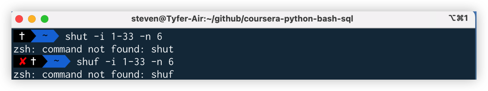
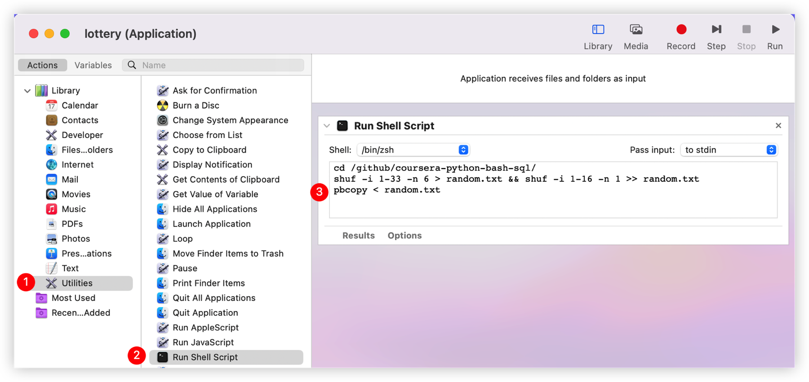

# 学以致用：随机生成福彩双色球红蓝号码

## 背景

在 Coursera 上学习杜克大学 (Duke University) 提供的 "Linux and Bash for Data Engineering"[^1] 课程，做练习时看到 `shuf` 命令，简单研究后得知[^2]，该命令可以从一组数字中随机选择若干数字并随机排列顺序。

本着学以致用的原则，尝试用 `shuf` 命令随机生成双色球的红蓝号码。

*注：双色球红球的号码范围为 1- 33，蓝球的为 1 - 16，一注的选号规则是 6 个蓝球号码，1 个红球号码。 本地机器的操作系统为 macOS Ventura。*

## 实践

根据一注双色球的选号规则，随机生成红球号码的命令为：`shuf -i 1-33 -n 6`。

第一次执行该命令，显示的错误信息是未发现 `shuf` 命令。

在 StackExchange 上查询后得知，可以使用 `brew` 安装  `coreutils` [^3] 获得 `shuf`。

安装后再次执行 `shuf -i 1-33 -n 6`，顺利获得 6 个红球号码。

## 改进

目标是用一行命令随机生成红蓝球号码，并将号码存入文件。

结合在该课程中学到的其他命令，实现目标。

1. 生成新文件：`touch random.txt`
2. 生成 6 个红球号码并添加 (`append`) 到文档中：`shuf -i 1-33 -n 6 >> random.txt`
3. 如果 2 成功，继续生成 1 个蓝球号码并追加 (`append`) 到文档中：` && shuf -i 1-16 -n 1 >> random.txt`
4. 查看文件：`cat random.txt`

## One More Thing

目标是不进入终端界面执行所有命令，并将生成的结果复制到系统的剪贴板中。

1. 因为不需要保存上次生成的号码，所以将生成红色号码的命令改为：`shuf -i 1-33 -n 6 > random.txt`，覆盖上次的文件。生成蓝色号码的命令仍为 `shuf -i 1-16 -n 1 >> random.txt`，追加到新生成的红色号码之后。
2. 将文档内容复制到系统剪贴板中[^4]：`pbcopy < random.txt`。
3. 使用 `macOS` 自带的  `Automator` 制作执行程序。

### 问题

但测试时出现错误，在终端中可以执行的 `shuf` 命令，在 Automator 中无法找到。

### 解决

不懂就搜索，原来在终端中的 `$PATH` 变量和 Automator 使用的不一样[^5]，按照提示，填入 `shuf` 的完整路径后，测试成功。

### DONE

### Get My Hand Dirty

[^1]: https://coursera.org/learn/linux-and-bash-for-data-engineering-duke/ungradedLab/koyVk/creating-a-shell-pipeline
[^2]: https://linuxhint.com/bash_shuf_command/
[^3]: https://apple.stackexchange.com/questions/142860/install-shuf-on-os-x
[^4]: https://unix.stackexchange.com/questions/211817/copy-the-contents-of-a-file-into-the-clipboard-without-displaying-its-contents
[^5]: https://discussions.apple.com/thread/5410624
