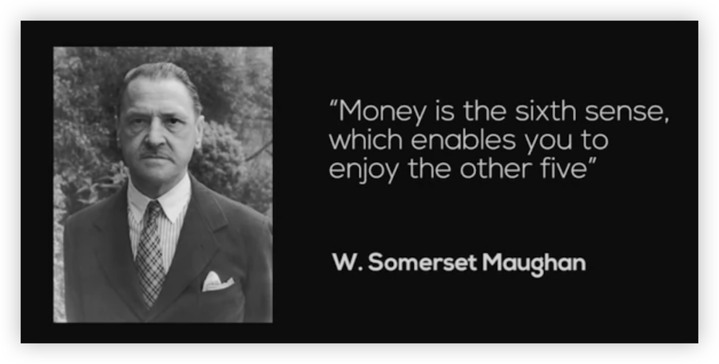
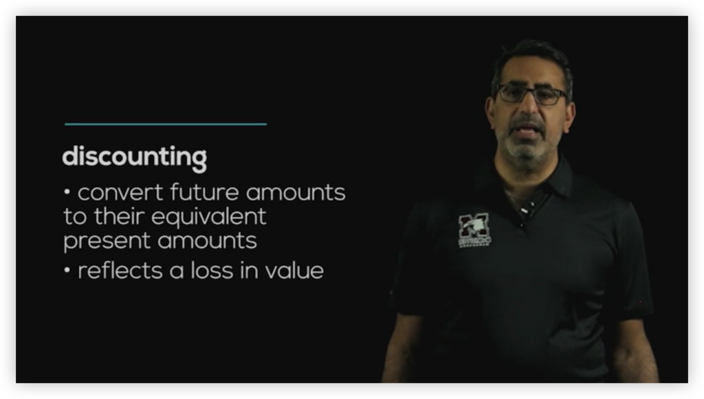
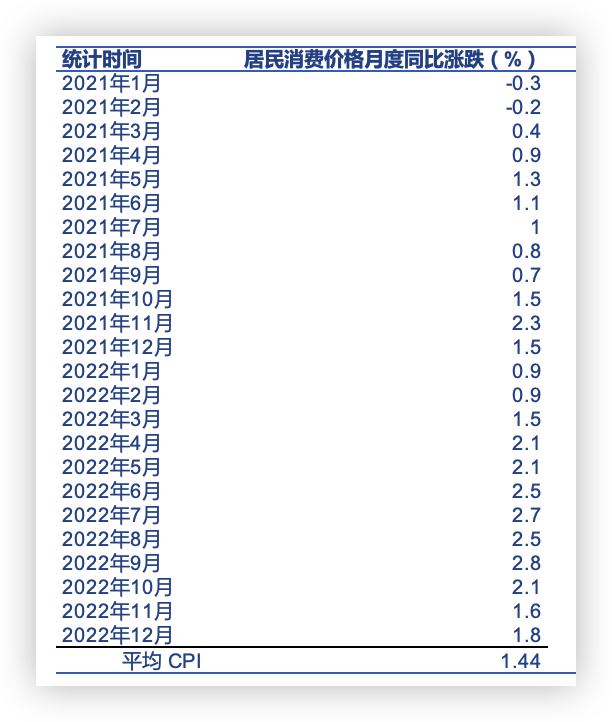
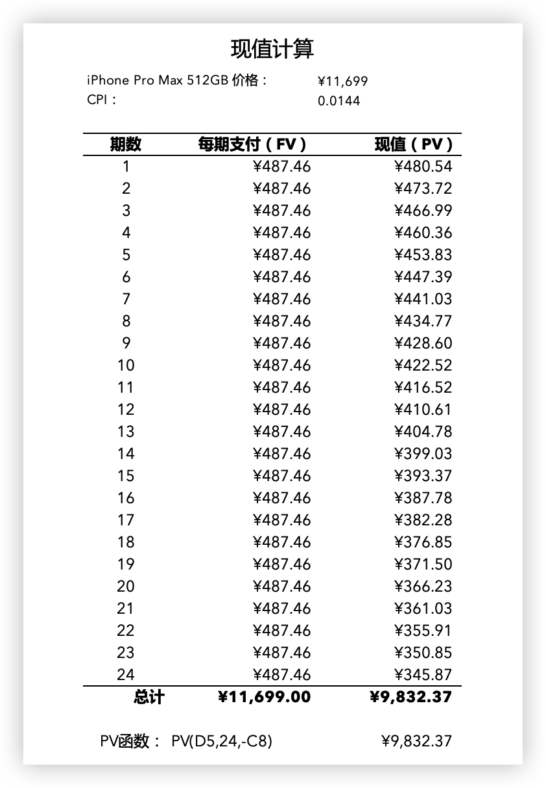

# 学以致用：24 期免息分期购买 iPhone 香吗？

## 背景

在 Coursera 的 Finance for Everyone (F4E) 课程中，学到“货币的时间价值 (time value of money)”和“贴现 (discounting)”这两个概念[1]：

> 货币的时间价值（time value of money）这个概念认为，当前拥有的货币比未来收到的同样金额的货币具有更大的价值[2]

回想日常看到的免息分期消费贷款，是否可以得出结论：分期结束后支付的总金额的现值小于目前商品标价？

下面就开始验证。

## 准备

1/ 确定免息分期贷款的实际案例

以苹果官网的 iPhone 14 Pro 512 GB 的 24 期免息分期为例。

2/ 确定衡量不同时期货币价值的指标

以我自己的认知，通货膨胀率应该是非常好的指标，和 F4E 课程中贴现反映了价值的损失 (reflects a loss in value) 的论述相通。不过在国家统计局官网未找到相应数据，但有对相关问题的回复：

> 通货膨胀是指流通中的货币数量超过经济实际需要而引起的货币贬值和物价水平全面持续的上涨。一般认为，居民消费价格指数（CPI）、商品零售价格指数（RPI）、工业生产者出厂价格指数（PPI）等指标都可以从不同角度反映通货膨胀的程度。[3]

同时，在“CPI 与通货膨胀有什么关系？”[4]一文中，指出：

> 在实践中，一般不直接、也不可能计算通货膨胀率，而是通过价格指数的年增长率来间接表示。

为了简单起见，在本文中使用 CPI 作为指标。

3/ 确定 CPI

计算中国政府网公布的从 2021 年 1 月至 2022 年 12 月 CPI [5] 数据的算术平均值，得到 1.44%。

4/ 确定现值公式中的各个因子

公式中：

FV (终值) = 每期支付的金额，

r (利率) = 24 个月的平均 CPI = 1.44%

t (期数) = 24 期 

## 验证

使用 Excel 内置的 PV 函数，计算如下：

## 结论

---

[1] https://www.coursera.org/lecture/finance-decisions/time-value-of-money-i-UBqna

[2] https://baike.baidu.com/item/%E8%B4%A7%E5%B8%81%E7%9A%84%E6%97%B6%E9%97%B4%E4%BB%B7%E5%80%BC/8273730

[3] http://www.stats.gov.cn/tjfw/tjzx/tjzxbd/201810/t20181015_1627786.html

[4] http://www.stats.gov.cn/ztjc/tjzs/zjcpi/201106/t20110613_71512.html

[5] http://www.gov.cn/shuju//hgjjyxqk/detail.html?q=1

